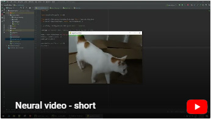

# neural-video
Converting video to deep neural network model, where input is index of a frame and the 
output is a rendered frame. The video is thus saved in the net's weights.

Link below will lead you to exemplary outcome of the repository:

